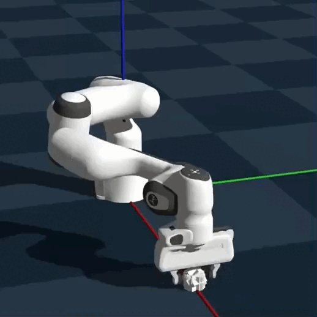
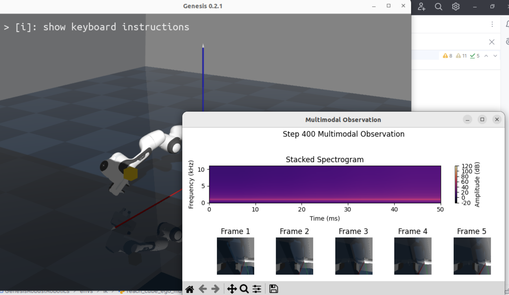

# Robust Multimodal Continual Learning for Robotics

This repository contains RL environments using the Genesis general-purpose physics platform to test multimodal continual learning.

You can choose between xyz-position based, vision-based and audio-based, and multimodal vision-audio based agents.


## 🔥 News
- [2025-08-03] Added commandline noise option for all modalities (IK only)
- [2025-07-22] Choose between direct torque control and inverse kinematics (IK) for all classes
- [2025-07-11] Added vision-audio multimodal class
- [2025-06-30] Added task-model classes for audio-modality
- [2025-06-17] Revolving task-model classes 
- [2025-06-14] Focus on the bare necessities
- [2025-06-13] Set up the repository

  
## 🚀 Requirements

(Tested on Ubuntu 22.04)

Clone the repo into your workspace: `git clone https://github.com/NicolasKuske/GenesisRobustRobotics.git`

Please install Pytorch fitting for your system.

(Optionally create a visual environment like conda before installing any packages)

You get the Genesis dependencies via: 
```
pip install genesis-world==0.2.1
```

Additional dependencies:
```
pip install tensorboard librosa sounddevice open3d
```
```
apt-get update && apt-get install -y libegl1-mesa libegl1-mesa-dev libgles2-mesa libgles2-mesa-dev libgl1-mesa-dev libglvnd-dev libxrender1 libxext6 libsm6 libgl1-mesa-glx libportaudio2 libasound-dev
```

🚀 Ready to roll! 

(Defaults to GPU usage without `-d cpu` flag)

```bash
cd GenesisRobustRobotics
python runners/ik/run_ppo_multimodal_IKsimple.py -v -n 1 {-d cpu}
```


#### 🛠️ Issue solutions

- In case of issue with igl expected parameter mismatch: 
```
cp {/your workspace}/GenesisRobustRobotics/rigid_geom.py {/usr/local/lib/python3.11/dist-packages}/genesis/engine/entities/rigid_entity/rigid_geom.py
```
adapt to your workspace and Genesis installation directory.

- If not on Ubuntu or in case of issue with graphical backend, comment out first line in runner scripts:
```
os.environ['PYOPENGL_PLATFORM'] = 'glx'  # comment out for Windows or MacOS
```

## ⚙️ Usage

- Training

You can run different learning algorithms with the following command structure. Here is an example of running training with 10 envs using xyz-position based RL and inverse kinematic (ik) control
```bash
python runners/ik/run_ppo_position_IKsimple.py -n 10
```
Exchange 'position' with 'vision' for vision based RL, or use 'multimodal' for vision-audio based multimodal RL. 

&nbsp;&nbsp;&nbsp;&nbsp; &nbsp;&nbsp;&nbsp;&nbsp; &nbsp;&nbsp;&nbsp;&nbsp; &nbsp;&nbsp;&nbsp;&nbsp; &nbsp;&nbsp;&nbsp;&nbsp; &nbsp;&nbsp;&nbsp;&nbsp;&nbsp;&nbsp;&nbsp;&nbsp; &nbsp;&nbsp;&nbsp;&nbsp; &nbsp;&nbsp;&nbsp;&nbsp; &nbsp;&nbsp;&nbsp;&nbsp; &nbsp;&nbsp;&nbsp;&nbsp; &nbsp;&nbsp;&nbsp;&nbsp; &nbsp;&nbsp;&nbsp;&nbsp; &nbsp;&nbsp;&nbsp;&nbsp; &nbsp;&nbsp;&nbsp;&nbsp; &nbsp;&nbsp;&nbsp;&nbsp; &nbsp;&nbsp;&nbsp;&nbsp; &nbsp;&nbsp;&nbsp;&nbsp;(Spectrogram and visual frames appear automatically for single enviroments `-n 1`). 


      &nbsp;&nbsp;&nbsp;&nbsp;    

- Evaluation

To test the trained policy, you can load a pretrained model from the checkpoint (if one has been saved) and visualize the rollout, by executing the script with the following command-line arguments:
```bash
python runners/{control_directory}/run_ppo_{modality}_{controller}.py -v -l `logs/{task}_{modality}_ppo_checkpoint.pth` 
```
Similarly, you can specify `modality` as you like.


#### 📈 Progress Plots

Launch TensorBoard in the project directory (where /runs is the folder that stores the checkpoint logfiles):
```bash
tensorboard --logdir runs --host 0.0.0.0 --port 6006
```

And on your local browser `http://localhost:6006`


## 💾 Saving and Loading Checkpoints

The agent periodically saves the model's weights and the target network state for later resumption (see the runner scripts). 

```python

if episode % 3 == 0:
     agent.save_checkpoint()
     print(f"\n Saved checkpoint to logs :)\n ")
```
You can load a checkpoint by setting the `--load` flag and choosing `logs/{task}_ppo_checkpoint.pth` (if it has been saved).

## ✅ Command-line Arguments

- `-v` or `--vis` enables visualization.
- `-l` or `--load_path` specifies the loading path of a previously saved model checkpoint. Do **not** include this argument if you intend to train your model from scratch.
- `-n` or `--num_envs` specifies the number of parallel environments. If none is provided, the default is `1`.

And many more explained in the runner scripts...

## 🍏 MacOS Usage

- Training

You can add `-d mps` to train:
```bash
python runners/torque/run_ppo_vision_torque.py -n 10 -d mps
```

- Evaluation

You can add `-d mps` to eval and visualization (-d cpu to run from cpu) :
```bash
python runners/torque/run_ppo_vision_torque.py -d cpu -l -v -n 1 -t ReachCubeEgoVisionStackedTorque -d mps
```

## 🙌 Acknowledgements 

This research project is part of the ENFIELD initiative - European Lighthouse to Manifest Trustworthy and Green AI - https://enfield-project.eu/

Cofunded by the European Union 

In collaboration with the Eindhoven University of Technology (TU/e)

and the Artificial and Natural Intelligence Toulouse Institute (ANITI)
